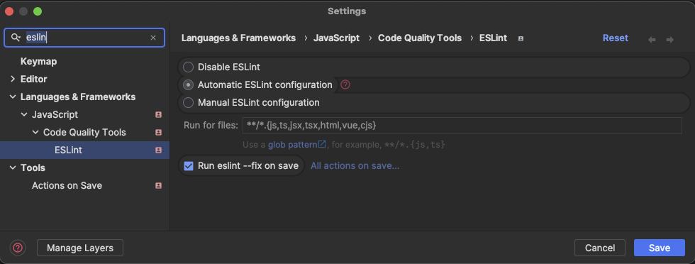

# Development

- [Development](#development)
  - [Commits](#commits)
  - [Environment variables](#environment-variables)
  - [Update dependencies](#update-dependencies)
  - [Linting, formatting and types](#linting-formatting-and-types)
    - [ESLint](#eslint)
      - [ESLint in Visual Studio Code](#eslint-in-visual-studio-code)
      - [ESLint in Rider](#eslint-in-rider)
    - [Tailwind](#tailwind)
      - [Tailwind in Visual Studio Code](#tailwind-in-visual-studio-code)
      - [Tailwind in Rider](#tailwind-in-rider)
    - [Typescript](#typescript)
      - [Setting up the typescript configuration](#setting-up-the-typescript-configuration)

<br>

## Commits

Thanks to the `commitlint` and `husky` packages, the commits are checked for the correct format.  
The commit message should be in the following format:

```bash
# type: feat, fix, docs, ...
# scope: the part of the project you are working on (optional)
# subject: short description of the changes
git commit -m "<type>(<scope>): <subject>"
```

Read more about the [Conventional Commits](https://github.com/conventional-changelog/commitlint)

<br>

## Environment variables

Before you add any environment variables or files to the project, please read section **Environment variables**  
in [README.md](./../README.md#environment-variables) file in the root directory.

<br>

## Update dependencies

```bash
yarn upgrade-interactive --latest
```

<br>

## Linting, formatting and types

### ESLint

The ESLint configuration is located in the `.eslintrc.json` file in the root directory  
and is imported and extended in the apps if needed.

There is no Prettier in this monorepo for a good reason. Having yet another tool to format the code and solving  
the conflicts between Prettier and ESLint is avoided thanks to the Anthony Fu's  `@stylistic/eslint-plugin` package.  
Now ESLint can do the same and at the same time warn us about the code quality.

[More on this subject](https://medium.com/@jolodev/my-thoughts-on-eslint-dropping-formatting-rules-2bc452bee5e2)  
[ESLint Stylistic](https://eslint.style/)

**RECOMMENDED**  
Add in your IDE the ESLint extension and activate formatting on save.  

#### ESLint in Visual Studio Code

<details><summary>Visual Studio Code settings</summary>

To use the ESLint extension in Visual Studio Code, install the `dbaeumer.vscode-eslint` extension.  
Add the following settings to the `settings.json` file in Visual Studio Code for the best experience.  

You can open the `settings.json` by going to `File -> Preferences -> Settings`  
and pressing on the `{}` icon in the top right corner.

🟦 **Note**  
> If you use the default `.code-workspace` file from the root directory, you don't need to add these settings.  
> They are already there.

```json
{
    "[html]": {
        "editor.defaultFormatter": "dbaeumer.vscode-eslint"
    },
    "[javascript]": {
        "editor.defaultFormatter": "dbaeumer.vscode-eslint"
    },
    "[typescript]": {
        "editor.defaultFormatter": "dbaeumer.vscode-eslint"
    },
    "[vue]": {
        "editor.defaultFormatter": "dbaeumer.vscode-eslint"
    },
    "editor.codeActionsOnSave": {
        "source.fixAll.eslint": "explicit"
    },
    "eslint.format.enable": true,
    "eslint.options": {
        "extensions": [
            ".html",
            ".js",
            ".cjs",
            ".vue",
            ".jsx"
        ]
    },
    "eslint.validate": [
        "html",
        "vue",
        "language",
        "javascriptreact",
        "typescript",
        "javascript"
    ],
}
```

</details>

#### ESLint in Rider

<details><summary>Rider settings</summary>

To use the ESLint extension in Rider, you need to open settings and search for ESLint and set the following settings:

- [x] Automatic ESLint configuration  
- Run for files: `**/*.{js,ts,jsx,tsx,html,vue,cjs}`  
- [x] Run eslint --fix on save



🟦 **Note**  
> If you are on a Mac you can open two windows of Rider in the same application.  
> Just open the second Project in the second window and choose the `Window -> Merge All Project Windows` option.  
> More on this subject [here](https://www.jetbrains.com/help/rider/Open_projects_and_solutions.html#switch_solutions)

</details>

<br>

### Tailwind

To work with a projects utilizing Tailwind CSS, you should **(strongly recommended)** install the Tailwind CSS IntelliSense extension.  
You will find one in the marketplace for Visual Studio Code as well as for Rider.

The extension will provide you with the IntelliSense for the Tailwind CSS classes, but not everywhere you could need it.  
That's why we developed additional configuration.

#### Tailwind in Visual Studio Code

<details><summary>Visual Studio Code settings</summary>

To use the Tailwind extension in Visual Studio Code, install the `bradlc.vscode-tailwindcss` extension.  
Add the following settings to the `settings.json` file in Visual Studio Code for the best experience.  

You can open the `settings.json` by going to `File -> Preferences -> Settings`  
and pressing on the `{}` icon in the top right corner.

🟦 **Note**  
> If you use the default `.code-workspace` file from the root directory, you don't need to add these settings.  
> They are already there.

```jsonc
{
    "tailwindCSS.experimental.classRegex": [
        // for VuePrime styling. Example: class: [strings_in_this_array]
        [
            "class:\\s*\\[((?:[^[\\]]|\\[(?:[^[\\]]|\\[[^[\\]]*\\])*])*?)\\]",
            "(?:['\"`]([^'\"`]*)['\"`])"
        ],
        // for computed functions. Example: const textClass = computed(() => ['text-red'])
        [
            "computed\\(\\s*\\(\\s*\\)\\s*=>\\s*([\\s\\S]*?)\\)",
            "(?:['\"`]([^'\"`]*)['\"`])"
        ],
        // additional inline option - add /*tw:*/ before any string
        "\\/\\*\\s?tw:\\s?\\*\\/\\s?['\"`](.*)['\"`]"
    ],
}
```

</details>

#### Tailwind in Rider

<details><summary>Rider settings</summary>

Install the `Tailwind CSS` plugin from the JetBrains marketplace.  
Then go to the `File -> Settings -> Languages & Frameworks -> Style Sheets -> Tailwind CSS`  
and ad this configuration to the `experimental > classRegex` field.

```json
{
    "experimental": {
        "classRegex": [
            [
                "class:\\s*\\[((?:[^[\\]]|\\[(?:[^[\\]]|\\[[^[\\]]*\\])*])*?)\\]",
                "(?:['\"`]([^'\"`]*)['\"`])"
            ],
            [
                "computed\\(\\s*\\(\\s*\\)\\s*=>\\s*([\\s\\S]*?)\\)",
                "(?:['\"`]([^'\"`]*)['\"`])"
            ],
            "\\/\\*\\s?tw:\\s?\\*\\/\\s?['\"`](.*)['\"`]"
        ]
    }
}
```

</details>

<br>

### Typescript

The typescript configuration is located in the `tsconfig.base.json` file in the root directory.

#### Setting up the typescript configuration

Keep in mind that referencing the `tsconfig.json` file in a project and changing any of the settings  
will not merge everything with the `tsconfig.base.json` file but partially override it.  
[More on this subject](https://miyoon.medium.com/array-parameters-in-tsconfig-json-are-always-overwritten-11c80bb514e1)

To see the typescript configuration, you can run the following command from the directory  
in which you want to see the local one - a merge/overwrite of the base and the extending one.  

```bash
npx tsc --showconfig
```
